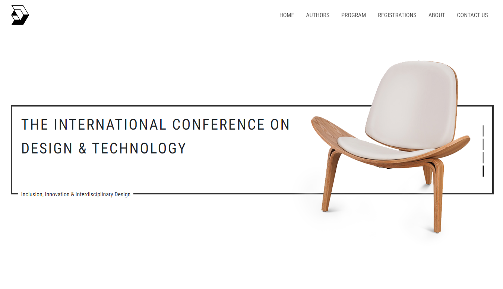

# Destech website showcase

This project was built on the branding project I have done for Destech conference in 2016. Our team at the time developed full branding for the conference including website. The entire branding have been implemented for the conference except the website due to the budget limitation. I created this website is mainly for showcase about how the website show appear in final presentation.

**:star: Any comments regarding the code will be highly appreciated, Thank you :smiley:**

[Destech website demo](https://destech.jiangpeigeng.com/)

## Language used
- [TypeScript](https://www.typescriptlang.org/)
- [SCSS](https://sass-lang.com/)
- [CSS](https://www.w3schools.com/css/)
- [HTML](https://www.w3schools.com/html/)

### Libraries used
- [Bootstrap](https://getbootstrap.com/docs/4.1/getting-started/introduction/)
- [React](https://reactjs.org/)
- [SASS](https://sass-lang.com/)

## Available Scripts
Runs the app in the development mode.\
Open [http://localhost:3000](http://localhost:3000) to view it in the browser.

The page will reload if you make edits.\
You will also see any lint errors in the console.

`npm run start` 

Runs the app in the development mode.

This project was bootstrapped with [Create React App](https://github.com/facebook/create-react-app).

`npm run build`

Builds the app for production to the `build` folder.\
It correctly bundles React in production mode and optimizes the build for the best performance.

The build is minified and the filenames include the hashes.\
Your app is ready to be deployed!

See the section about [deployment](https://facebook.github.io/create-react-app/docs/deployment) for more information.
